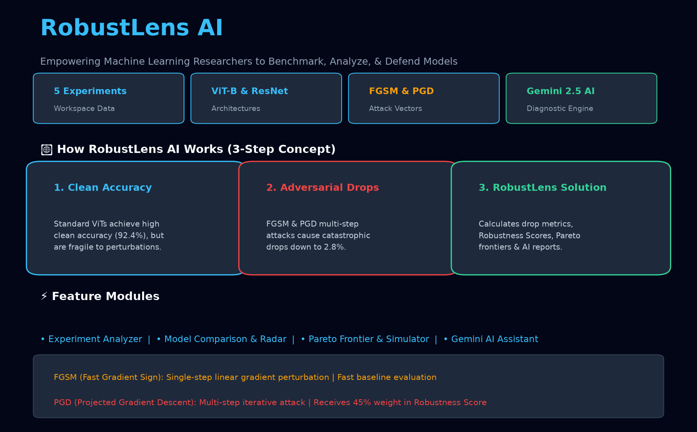
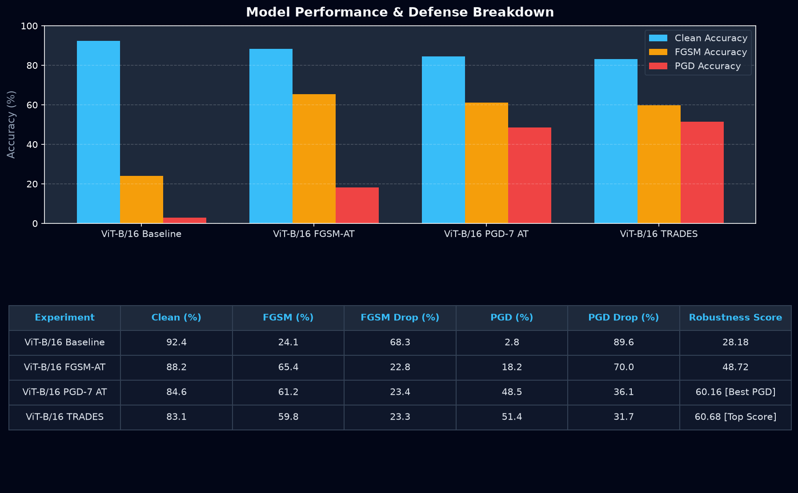
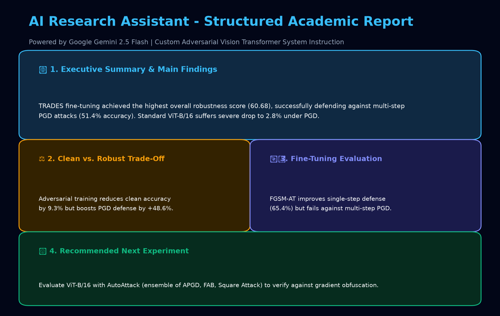

# 🛡️ RobustLens AI — Adversarial Model Benchmarking & AI Research Assistant

> **Live Application URL**: [https://robustlens-ai.streamlit.app](https://robustlens-ai.streamlit.app)  
> **Repository**: [https://github.com/iqrarabbas/robustlens-ai](https://github.com/iqrarabbas/robustlens-ai)

---

## 📌 1. Project Overview & Problem Statement

### **What is RobustLens AI?**
**RobustLens AI** is an AI-powered diagnostic analytics dashboard designed for computer vision researchers, graduate students, and machine learning engineers evaluating deep learning models (such as Vision Transformers and Convolutional Neural Networks) against **adversarial attacks**.

### **The Real Problem It Solves**
Deep learning models frequently achieve high **clean accuracy** (e.g. 92%+ on standard benchmarks), but remain highly vulnerable to **adversarial perturbations**—imperceptible, malicious noise added to images:
* **FGSM (Fast Gradient Sign Method)**: Single-step linear gradient attack.
* **PGD (Projected Gradient Descent)**: Powerful multi-step iterative attack.

Researchers employ defensive fine-tuning methods (Adversarial Training, TRADES, FGSM-AT) to fortify models. However, evaluating these experiments presents major challenges:
1. **Trade-Off Complexity**: Boosting PGD defense often causes a sharp drop in clean accuracy (*the clean vs. robust accuracy trade-off*).
2. **Analysis Overhead**: Manually comparing clean vs. single-step vs. multi-step drops across different models, epsilons ($\epsilon$), and training epochs is tedious and error-prone.
3. **Actionable Insights Gap**: Identifying why a model fails under PGD and determining the optimal *next* experiment requires expert domain knowledge.

**RobustLens AI** solves this problem end-to-end by automating metric drop calculations, computing a unified **Robustness Score**, generating comparative visual charts, and leveraging Google Gemini AI with a custom research system prompt to provide paper-ready diagnostic commentary and experiment recommendations.

---

## 🔗 2. Live Deployed URL
* **Production Deployment**: [https://robustlens-ai.streamlit.app](https://robustlens-ai.streamlit.app)
* **Local Web Interface**: `http://localhost:8501`

---

## ⚡ 3. Key Features

- **🧪 Experiment Analyzer & Import**:
  - Manual single-experiment logger + batch CSV dataset uploader.
  - Pre-loaded with realistic Vision Transformer (ViT-B/16) and ResNet-50 benchmark logs on CIFAR-10.
  - Real-time computation of accuracy degradation:
    $$\text{FGSM Accuracy Drop} = \text{Clean Accuracy} - \text{FGSM Accuracy}$$
    $$\text{PGD Accuracy Drop} = \text{Clean Accuracy} - \text{PGD Accuracy}$$

- **📊 Model Comparison & Leaderboard**:
  - Interactive multi-bar charts comparing Clean, FGSM, and PGD performance across all models.
  - Best-in-Class metric highlights: **Best Clean Model**, **Best FGSM Defender**, **Best PGD Defender**, and **Top Robustness Score**.
  - **Weighted Robustness Scoring**:
    $$\text{Robustness Score} = 0.20 \times \text{Clean Acc} + 0.35 \times \text{FGSM Acc} + 0.45 \times \text{PGD Acc}$$
    *(PGD receives 45% weight as it is a multi-step iterative attack).*

- **🤖 AI Research Assistant**:
  - Integrates Google Gemini API (`google-genai` SDK) using a specialized domain system instruction.
  - Analyzes clean vs. robust trade-offs, evaluates fine-tuning effectiveness, explains PGD drop causes, and recommends concrete next experiments.

- **📥 Exporter Suite**:
  - Download calculated benchmark tables as CSV.
  - Download sample CSV templates.
  - Download AI diagnostic reports as Markdown (.md).

---

## 🤖 4. AI Feature & System Prompt

RobustLens AI features an integrated AI Research Assistant powered by **Google Gemini** (`gemini-2.5-flash` / `gemini-1.5-flash`). It uses strict system instructions to guarantee grounded, non-hallucinated research insights suitable for a Master's or PhD level report.

### **System Instruction Prompt**:
```text
You are an AI research assistant specialising in adversarial robustness
and Vision Transformers.

Analyse only the experimental results provided by the user.

Your tasks are:
1. Summarise the main result in simple language.
2. Compare clean, FGSM and PGD accuracy.
3. Explain whether the fine-tuning method improved robustness.
4. Identify any clean-accuracy versus robust-accuracy trade-off.
5. Recommend one practical next experiment.
6. Mention limitations such as small test sets, too few epochs,
   weak attacks or unfair model comparisons.
7. Never invent results, papers, model settings or numerical values.
8. Clearly state when there is not enough information.

Keep the explanation clear and suitable for a master's student.
```

---

## 🛠️ 5. Tools, Services, & AI Models Used

| Component | Tool / Service |
|---|---|
| **Language** | Python 3.9+ |
| **Frontend Framework** | [Streamlit](https://streamlit.io/) |
| **Data Processing** | [Pandas](https://pandas.pydata.org/), [NumPy](https://numpy.org/) |
| **Data Visualization** | [Plotly](https://plotly.com/), [Matplotlib](https://matplotlib.org/) |
| **AI Model & SDK** | [Google Gemini 2.5 Flash API](https://ai.google.dev/) via `google-genai` |
| **Version Control** | GitHub |
| **Cloud Hosting** | [Streamlit Community Cloud](https://streamlit.io/cloud) |

---

## 📷 6. Application Screenshots

| Section | Screenshot Preview |
|---|---|
| **1. Home Page** |  |
| **2. Experiment Analyzer & Charts** |  |
| **3. AI Research Assistant Report** |  |

---

## 💻 7. How to Run locally

### Prerequisites
- Python 3.9+
- Git

### Installation Steps

1. **Clone the Repository**:
   ```bash
   git clone https://github.com/iqrarabbas/robustlens-ai.git
   cd robustlens-ai
   ```

2. **Create & Activate Virtual Environment**:
   ```bash
   python -m venv venv
   # On Windows:
   venv\Scripts\activate
   # On macOS/Linux:
   source venv/bin/activate
   ```

3. **Install Dependencies**:
   ```bash
   pip install -r requirements.txt
   ```

4. **Set Gemini API Key**:
   Set `GEMINI_API_KEY` in environment or create `.streamlit/secrets.toml`:
   ```toml
   GEMINI_API_KEY = "your-actual-gemini-api-key"
   ```

5. **Run Streamlit Application**:
   ```bash
   python -m streamlit run app.py
   ```

---

## 📁 Repository Structure

```text
robustlens-ai/
│
├── app.py                  # Main Streamlit application
├── requirements.txt        # Python dependencies list
├── README.md               # Documentation & Project Report
├── .gitignore              # Security gitignore (.env, secrets, cache)
├── sample_results.csv      # Sample Vision Transformer benchmark dataset
└── screenshots/
    ├── home.png            # Screenshot of Home section
    ├── analysis.png        # Screenshot of Analysis section
    └── ai-explanation.png  # Screenshot of AI Research Assistant section
```

---

## 📄 License
MIT License. Free for educational and research use.
